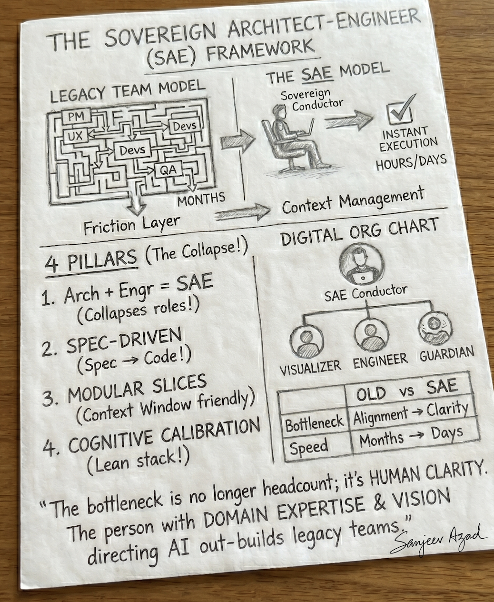
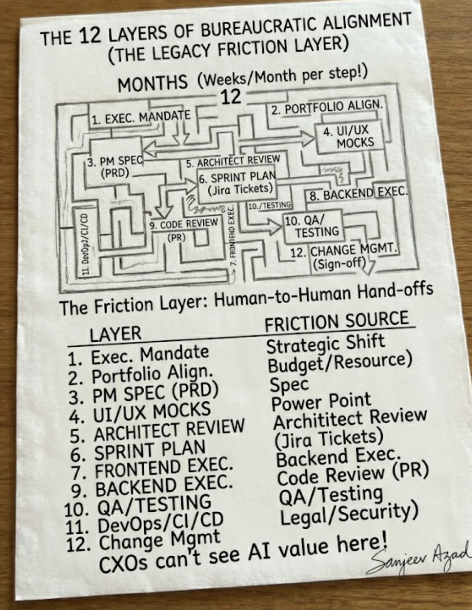

# The Sovereign Architect‑Engineer (SAE) Framework 🚀

> **Agile has become corporate malpractice. The reign of the Sovereign Architect‑Engineer begins.**



The SAE Framework is an open‑source, **team‑of‑one** methodology for the AI era. It empowers a single individual with deep tech‑architecture and domain knowledge to **design, code, test, and deploy enterprise‑grade software end‑to‑end** — by orchestrating *digital context* instead of managing *human headcount*.

📖 **[Read the full playbook on the Wiki →](https://github.com/Passion4Architecture/sae-framework/wiki)**  ·  ⚡ **[Framework at a Glance](https://github.com/Passion4Architecture/sae-framework/wiki/Framework-at-a-Glance)** (the whole thing on one page)

[](LICENSE) · [](https://github.com/Passion4Architecture/sae-framework/wiki) · [](CONTRIBUTING.md)

---

## 🧭 The Point of View

Most "AI coding" advice optimizes the wrong layer — it makes a single engineer type faster inside a process built for twelve people. The SAE thesis is sharper:

> **The cost of code, infrastructure, and boilerplate has collapsed toward zero. The bottleneck is no longer execution — it is human clarity.**

When syntax is free, the leverage moves to **structural systems thinking, precise bounded‑context definition, and clear specification**. The person with the deepest domain insight and the sharpest architectural vision — not the largest team — wins. The SAE Framework is the operating system for that person.

This is an **opinionated** framework. It makes bold claims on purpose. It also names its own limits honestly (see [Real Challenges & Limits](#-real-challenges--limits)) — because a method that can't tell you when *not* to use it is marketing, not engineering.

---

## 🏗️ The Problem: The 12 Layers of Bureaucratic Alignment

Traditional corporate development forces instantaneous AI capability through horse‑and‑buggy human structures. A single idea must survive twelve hand‑offs to reach production:



`Exec Mandate → Portfolio Alignment → PM Spec (PRD) → UI/UX Mocks → Architect Review → Sprint Plan → Frontend → Backend → Code Review (PR) → QA → DevOps/CI/CD → Change‑Mgmt Sign‑off`

This isn't a process problem — it's a **math** problem. Communication channels grow quadratically with headcount (Brooks's Law):

```
C = N(N − 1) / 2        →  a 12-person squad = 66 communication pathways
```

**The SAE Framework collapses these 12 layers into a single, automated execution loop** — dropping coordination cost from O(N²) to O(1) by collapsing the team to N = 1.

→ Full breakdown with the legacy‑vs‑SAE collapse table: **[The 12 Layers of Friction](https://github.com/Passion4Architecture/sae-framework/wiki/The-12-Layers-of-Friction)**

---

## 🧠 The Bottleneck Shift

| Era | Scarce resource | Winning move |
|---|---|---|
| Legacy | Engineering hours / syntax fluency | Hire more engineers |
| **AI‑native** | **Human clarity** | Sharpen structural thinking, bounded contexts, specs |

---

## 🧱 Core Pillars

| Pillar | What it means | Deep dive |
|---|---|---|
| **The Architect‑Engineer Collapse** | High‑level structural vision *and* instant multi‑file execution in one person | [Module 1](https://github.com/Passion4Architecture/sae-framework/wiki/Module-1:-The-Sovereign-Paradigm-Shifts) |
| **Single‑Shot Vertical Slice** | Build a feature end‑to‑end (schema → API → state → UI) in one cycle so layers align by construction | [Module 2](https://github.com/Passion4Architecture/sae-framework/wiki/Module-2:-Core-Pillars-of-SAE-Architecture) |
| **Spec‑Driven Development (SDD)** | The Markdown spec — not the code — is the source of truth; fix bugs by editing the spec first | [Module 2](https://github.com/Passion4Architecture/sae-framework/wiki/Module-2:-Core-Pillars-of-SAE-Architecture) · [Template](https://github.com/Passion4Architecture/sae-framework/wiki/SDD-Spec-Template) |
| **High‑Context Modular Design** | Structure code for "AI readability": small cohesive files, strict bounded contexts | [Module 2](https://github.com/Passion4Architecture/sae-framework/wiki/Module-2:-Core-Pillars-of-SAE-Architecture) |
| **Cognitive Load Minimization** | A "Zero‑Ops" stack — if a tool needs a dedicated admin, it's banned | [Module 4](https://github.com/Passion4Architecture/sae-framework/wiki/Module-4:-The-Lean-SAE-Tech-Stack) |

---

## 🎼 The Digital Org Chart

The operator conducts AI personas instead of managing people:

- **Conductor** (you) — architecture, edge‑case verification, structural‑drift review, final calls
- **Visualizer** — generative UI → semantic components
- **Engineer** — repo‑aware code generation from the spec
- **Guardian** — autonomous, *adversarial* QA whose job is to break what the Engineer builds

→ [Module 3: The Digital Org Chart](https://github.com/Passion4Architecture/sae-framework/wiki/Module-3:-The-Digital-Org-Chart)

---

## ⚙️ The Zero‑Ops Reference Stack

| Tier | SAE selection | Friction eliminated |
|---|---|---|
| Workspace & Execution | Cursor + Claude Code | Ticketing, manual syntax, status meetings |
| Frontend | Next.js + v0 + Shadcn | Build pipelines, UI boilerplate, CSS debugging |
| Data | Supabase / Neon Postgres | DB provisioning, pool tuning, API scaffolding |
| Compute | Vercel / Cloudflare Edge | Servers, containers, reverse proxies, routing |

*Principle over product — the tools are interchangeable, Zero‑Ops is the law.* → [Approved Zero‑Ops Tooling List](https://github.com/Passion4Architecture/sae-framework/wiki/Approved-Zero-Ops-Tooling-List)

---

## ⚖️ Real Challenges & Limits

This framework is bold, not naïve. The honest trade‑offs every operator should weigh before adopting it:

- **Single point of failure (bus factor).** Collapsing to N = 1 concentrates all accountability on one person. *Mitigation:* ruthless Spec‑Driven Development — if the `specs/` folder is authoritative and current, the project stays legible to anyone who reads it. The spec is the succession plan.
- **You can't review what you can't evaluate.** The role collapse is *role‑based, not knowledge‑based*. An operator who can't read the generated SQL, spot an auth flaw, or judge a data model will ship confident, plausible nonsense. SAE removes the hand‑off, not the expertise.
- **"Bypass integration testing" is shorthand, not literal.** Single‑shot slicing removes the cross‑team *seam*, not the need to verify behaviour. Edge cases, concurrency, auth, and external‑failure paths still need explicit tests — that's why the Guardian exists.
- **Vendor lock‑in is a real cost.** Zero‑Ops trades operational control for vendor dependence. Favour tools with standard exit formats (plain Postgres, portable components) so Zero‑Ops never becomes zero‑leverage.
- **Regulated & safety‑critical domains.** Some of the 12 layers (architect review, change sign‑off) are *legally mandated*. Keep the gates; apply SAE *within* them to remove latency, not controls. For life‑critical systems, speed is the wrong optimization.
- **The #1 failure mode: a stale spec.** The moment code and spec disagree and the code silently wins, you've lost your source of truth. Fold every hand‑fix back into the spec the same day.

→ Full guidance, including when *not* to use the framework and an FAQ: **[When NOT to Use SAE](https://github.com/Passion4Architecture/sae-framework/wiki/When-Not-to-Use-SAE)**

> Teams don't have to collapse to N = 1 to benefit. Adopt the **practices** — SDD, vertical slices, AI hygiene, Zero‑Ops, adversarial QA — without literally firing the org chart. The practices deliver most of the value; the N = 1 collapse is the radical end of the spectrum.

---

## 🗺️ Playbook Modules

The full framework lives on the [Wiki](https://github.com/Passion4Architecture/sae-framework/wiki):

- [x] **[Module 1: The Sovereign Paradigm Shifts](https://github.com/Passion4Architecture/sae-framework/wiki/Module-1:-The-Sovereign-Paradigm-Shifts)** — the friction layer & bottleneck shift
- [x] **[Module 2: Core Pillars of SAE Architecture](https://github.com/Passion4Architecture/sae-framework/wiki/Module-2:-Core-Pillars-of-SAE-Architecture)** — Spec‑Driven Dev, vertical slices & AI hygiene
- [x] **[Module 3: The Digital Org Chart](https://github.com/Passion4Architecture/sae-framework/wiki/Module-3:-The-Digital-Org-Chart)** — Conductor, Visualizer, Engineer, Guardian
- [x] **[Module 4: The Lean SAE Tech Stack](https://github.com/Passion4Architecture/sae-framework/wiki/Module-4:-The-Lean-SAE-Tech-Stack)** — Zero‑Ops integration & scorecard
- [x] **[Module 5: Project Navigation & Metrics](https://github.com/Passion4Architecture/sae-framework/wiki/Module-5:-Project-Navigation-&-Metrics)** — Context Entropy vs. story points

**Get hands‑on:** [Getting Started](https://github.com/Passion4Architecture/sae-framework/wiki/Getting-Started) · [Agent Setup & Configuration](https://github.com/Passion4Architecture/sae-framework/wiki/Agent-Setup-and-Configuration) · [SDD Spec Template](https://github.com/Passion4Architecture/sae-framework/wiki/SDD-Spec-Template) · [Glossary](https://github.com/Passion4Architecture/sae-framework/wiki/Glossary)

---

## 🔁 Practice & Execution

The principles above become an operating system here — how you actually run the loop, day to day:

- **[The End‑to‑End Lifecycle](https://github.com/Passion4Architecture/sae-framework/wiki/The-End-to-End-Lifecycle)** — the canonical 10‑phase loop (Frame → Spec → … → Ship → Observe → Maintain)
- **[Scenario Playbooks](https://github.com/Passion4Architecture/sae-framework/wiki/Scenario-Playbooks)** — worked walkthroughs: greenfield, feature add, bug fix, migration, integration, incident, legacy onboarding
- **[Operator Techniques](https://github.com/Passion4Architecture/sae-framework/wiki/Operator-Techniques)** — the tactical moves (context priming, adversarial review, spec‑first debugging, prompt patterns)
- **[Best Practices](https://github.com/Passion4Architecture/sae-framework/wiki/Best-Practices)** — do/don't across spec, context, QA, security, git, cost — plus the five non‑negotiables
- **[KPIs & Metrics](https://github.com/Passion4Architecture/sae-framework/wiki/KPIs-and-Metrics)** — what a team of one measures (and the vanity metrics to ignore)
- **[Risks, Security & Governance](https://github.com/Passion4Architecture/sae-framework/wiki/Risks-Security-and-Governance)** — AI‑specific risks, security defaults, privacy/compliance, the pre‑ship checklist

---

## 📂 Repository Layout

```
sae-framework/
├── README.md          # You are here — the overview & point of view
├── CONTRIBUTING.md     # How to contribute tools, case studies, templates
├── LICENSE             # MIT
├── assets/             # Framework diagrams & sketches
└── (the full playbook lives in the GitHub Wiki)
```

---

## 🤝 How to Contribute

We want the global community of builders, founders, and engineers to make the SAE framework the industry standard for solo execution. We especially welcome **honest case studies** — including failures and limits, not just 10x wins.

1. Read [CONTRIBUTING.md](CONTRIBUTING.md).
2. Grab an open issue, or propose a new tool / case study / spec template.
3. Submit a Pull Request (repo) or push to the [Wiki](https://github.com/Passion4Architecture/sae-framework/wiki) for playbook content.

---

**Maintained by Sanjeev Azad** · Licensed under [MIT](LICENSE)
